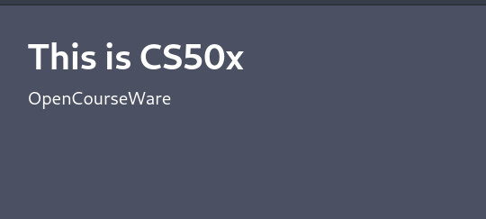
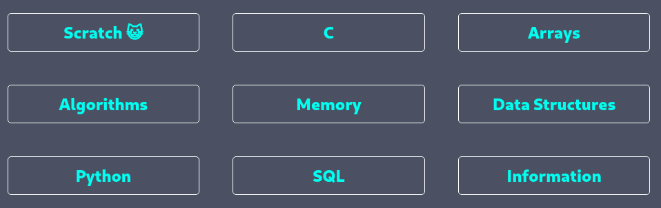
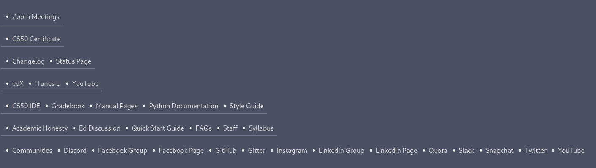

# CS50x 2020 concept
A Dark mode version for the CS50x Harvard website.

## Table of Contents
- [What's New](#What's-New)
- [Manual](#manual)
- [Clone](#clone)
- [Technologies](#technologies)
- [Inspiration](#inspiration)

## What's New 

- Dark Mode
    like all developer tools (IDE,  text editors)
- More focus on course content 
    Move all sidebar to the bottom to reduce distraction
---

## Manual
- To go to the home page click the link at the top-left of the page

- On the home page, you will find a list for weeks from 0 to 8

- The sidebar links have moved to the bottom of the page

---
## Clone
To clone, you'll need Git and Node.js (which comes with npm) installed on your computer.
From your command line:

1. Clone this repository

	- git clone https://github.com/M-Hafez22/cs50x-concept.git

1. Go into the repository

    - cd cs50x-concept

3. Install dependencies

	- npm install

4. Run the app

	- npm start

- Also, this project is hosted on GitHub-pages at https://m-hafez22.github.io/cs50x-concept/#/

---

## Technologies

 - React version : ^17.0.0
 - Sass version   : ^4.14.1

    you can see all dependencies from **[package.json](package.json)**
---
## Inspiration

- 	This is my **Final Project** for **CS50x**.
- I really enjoyed this course especially as it focuses more on how to **be a developer** rather than how to develop a project.

---
 **Finally, I would like to thank everyone who co-produced this course.**
